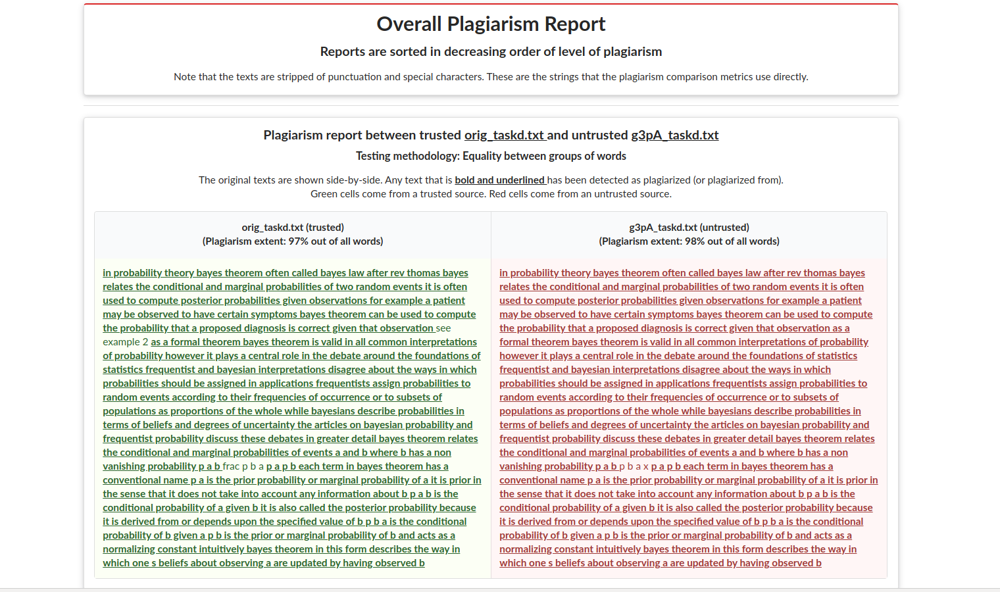

# Basic Plagiarism Detection
## 1. Motivation
Online plagiarism detection tools usually come with a few constraints. It could be a paid-only service, the number of characters to check could be artificially limited, etc. This tool aims to fill a gap where:
- Plagiarism cases are usually simple copy-paste jobs of a few text phrases with minor edits,
- Paying for an online tool is unpalatable,
- The source texts that might be copied from can be put together manually by the user into a few files (i.e. the Internet is not automatically searched by the tool), or the only concern is people copying from each other, and
- Running a command-line tool is simple enough for the user

## 2. Table of Contents
<!-- TOC depthFrom:2 -->

- [Basic Plagiarism Detection](#basic-plagiarism-detection)
  - [1. Motivation](#1-motivation)
  - [2. Table of Contents](#2-table-of-contents)
  - [3. Philosophy](#3-philosophy)
  - [4. Definitions](#4-definitions)
  - [5. Project Objectives](#5-project-objectives)
    - [5.1. Hard Objectives](#51-hard-objectives)
    - [5.2. Soft (Optimization) Objectives](#52-soft-optimization-objectives)
    - [5.3. Anti-Objectives](#53-anti-objectives)
  - [6. Project Status](#6-project-status)
  - [7. Installation Options](#7-installation-options)
    - [7.1. Binary Release](#71-binary-release)
    - [7.2. Cargo Install](#72-cargo-install)
    - [7.3. Building from source](#73-building-from-source)
  - [8. Usage](#8-usage)
  - [9. Examples](#9-examples)
  - [10. Technical Details](#10-technical-details)
    - [10.1. Defining Plagiarism](#101-defining-plagiarism)
    - [10.2. Choosing n, s and M](#102-choosing-n-s-and-m)

<!-- /TOC -->
## 3. Philosophy
This tool is really only to catch amateur attempts at plagiarism. Whatever your opinion is on plagiarism tools, we can probably agree that lazy copy-paste jobs of chunks of text should probably not be respected. Therefore, this tool is designed to make detecting these situations easier.

## 4. Definitions
- Untrusted: Something that might be plagiarised
- Trusted: Something that is definitely not plagiarised, but might be a source used in plagiarism

## 5. Project Objectives
### 5.1. Hard Objectives
- Detect potential cases of plagiarism between multiple untrusted strings (intra-source plagiarism)
- Detect potential cases of plagiarism between trusted source strings and untrusted strings (external-source plagiarism)

### 5.2. Soft (Optimization) Objectives
1. Minimizing false positive and false negative detection rates
2. Fastest possible detection speed without compromising objective 1.

### 5.3. Anti-Objectives
- The project **does not aim to search the Internet automatically** for potential plagiarism sources. These sources have to be assembled by users manually into text files in the `trusted` folder.
- This is **not a tool for code plagiarism detection!**. Please refer to [Stanford's MOSS](https://theory.stanford.edu/~aiken/moss/) instead.

## 6. Project Status
- All options are usable in the executable, and the `equal` metric is quite fast at detecting copy-paste plagiarism of a few words.
- The `lev` metric is faster now by parallelizing using `rayon` and promises more fine-grained control over how different two phrases can be. However, it might be slow for very large datasets.
- The current output format is both in HTML and in the terminal. In the HTML output, both texts are displayed side-by-side, with all detected plagiarized phrases being highlighted in bold. The percent of plagiarism detected (# plagiarized words / all words * 100%) is also indicated for each source pair. The goal is for all of this to be color-coded, which is a project priority.

## 7. Installation Options
### 7.1. Binary Release
Download a binary from the [Releases](https://github.com/frizensami/plagiarism-basic/releases/) page. Currently only `x86_64-unknown-linux-gnu` targets are supported. 

### 7.2. Cargo Install
1. Install the `rust` language toolchain (https://www.rust-lang.org/tools/install).
1. Run `cargo install plagiarism-basic`
1. The executable should be installed from `crates.io` automatically by `cargo`. 

### 7.3. Building from source
1. The previous two options will likely distribute an outdated version of this tool. For the most up-to-date code, building from source is recommended.
1. Install the `rust` language toolchain (https://www.rust-lang.org/tools/install).
1. `git clone` this repository to a folder of your choice.
1. Run `cargo build --release` in that folder.
1. The `target/release` folder will contain the `plagiarism-basic` executable to be used.

## 8. Usage
Some setup is required to use this tool.
- There are **three folders** where source text can be kept. These folders can be **named anything you'd like**, but the names must be specified in the options to the program later.
    1. **Mandatory**: an **"untrusted" folder** to hold source texts that might be guilty of plagiarism. This could be where student submissions are placed.
    1.  Not mandatory: A **"trusted" folder** where texts that are highly likely to be copied from can be placed. This could contain text files with the content of the top ten Google search results for a particular question, or reference text material that is likely to be copied.
    1. Not mandatory: An **"ignore" folder** where strings of text that should be ignored are placed. If students are answering a particular essay question, you might want to put that question itself as a source in the "ignore" folder so that those strings in students answers will not trigger a plagiarism warning.
- An example can be found in the `plagiarismbasic_lib/testfiles/cs-corpus` directory of the GitHub repository.
- Each folder may contain any number of files in its top-level directory (i.e. subdirectories inside those folders will be ignored). Each file will be treated as a separate source of text (whether trusted, untrusted, or content to be ignored). 
- The files in both folders must only contain UTF-8 interpretable text (which should be the case barring any really special characters). 
- The name of the file will be used in the output of the program, so naming the files appropriately is a good idea. 
- After these steps are done, the `plagiarism-basic` executable can be run and the path to these folders can be specified in the arguments to the executable.
```
$ ./plagiarism-basic -h
Basic Plagiarism Checker 
Sriram Sami (@frizensami on GitHub)
Checks for plagiarism using very basic metrics between different text files

USAGE:
    plagiarism-basic [FLAGS] [OPTIONS] --metric <metric> --sensitivity <sensitivity> --similarity <similarity> --untrusted <untrusted-directory>

FLAGS:
    -h, --help        Prints help information
        --openhtml    If the HTML file should be opened automatically after writing
        --cli         If the results should be printed to the command line
        --html        If the results should be printed to a HTML file
    -V, --version     Prints version information

OPTIONS:
    -i, --ignore <ignore-directory>          Sets the directory containing text files with content to be ignored from
                                             plagiarism checks.
    -m, --metric <metric>                    Sets the metric (function) used for similarity testing. Equal checks that
                                             both strings are equal, and lev uses the Levenshtein distance [possible
                                             values: equal, lev]
    -n, --sensitivity <sensitivity>          Sets the number of words required to form a unit of plagiarism checking
    -s, --similarity <similarity>            Sets the threshold value for plagiarism to be detected by a chosen metric
    -t, --trusted <trusted-directory>        Sets the directory containing trusted text files. Each file will be treated
                                             as a separate possible plagiarism source text.
    -u, --untrusted <untrusted-directory>    Sets the directory containing untrusted text files. Each file will be
                                             treated as a separate submission by a separate person.
```
## 9. Examples
**Exact string matching:**
```
./plagiarism-basic -t testfiles/cs-corpus/t/ -u ./testfiles/cs-corpus/ut/ -m equal -n 10 -s 0 --openhtml --cli --html
```

**Levenshtein distance matching:**
```
./plagiarism-basic -t testfiles/cs-corpus/t/ -u ./testfiles/cs-corpus/ut/ -m lev -n 5 -s 1 --openhtml --cli --html
```

**With Cargo from this folder:**
```
cargo run --release -- -t plagiarismbasic_lib/testfiles/cs-corpus/t/ -u plagiarismbasic_lib/testfiles/cs-corpus/ut/ -m equal -n 10 -s 0 --openhtml --cli --html
```


**Output (Basic HTML)**



## 10. Technical Details
### 10.1. Defining Plagiarism
Informally, two strings that are long enough and with the same number of words that are "similar enough" by a chosen metric are considered to be plagiarised. 

Formally:
- Two separate strings (`s1` and `s2`) consisting of words (a sequence of characters without a space) are considered plagiarised if: 
- Both have `l` words
    - Where `l` < some user-chosen *sensitivity value* `n`
- Where a metric `M` and *similarity value* `s` produces `M(s1, s2) <= s`
- Subject to pre-processing of
    - Removing CR + LF
    - Removing extra spaces (only one space between words)
    - Converting all letters to lowercase
    - Removing all non alphanumeric characters

### 10.2. Choosing n, s and M
- `n` is a user-chosen value to indicate **how many words** a string needs to be before being considered for plagiarism. If the value is too low, the false positive rate will be very high (imagine matching the phrase "I am" for `n = 2`). If the value is too high, correspondingly, the false negative rate will be too high.
- `s` is a user-chosen value to indicate **how similar** the strings have to be before being considered for plagiarism. This follows the opposite false positive/negative trend as `n` (too high = too many false positive and vice versa), but only affects results when a non `equal` metric is used.
- `M` is the **metric** used to evaluate the strings for similarity. They can be one of the following
    - `equal`: checks if the strings are equal, ignores `s` value. Uses hashed set intersections, very fast.
    - `lev`: uses the Levenshtein distance between the words, uses the `s` value. Compares between all combinations of string fragments.
